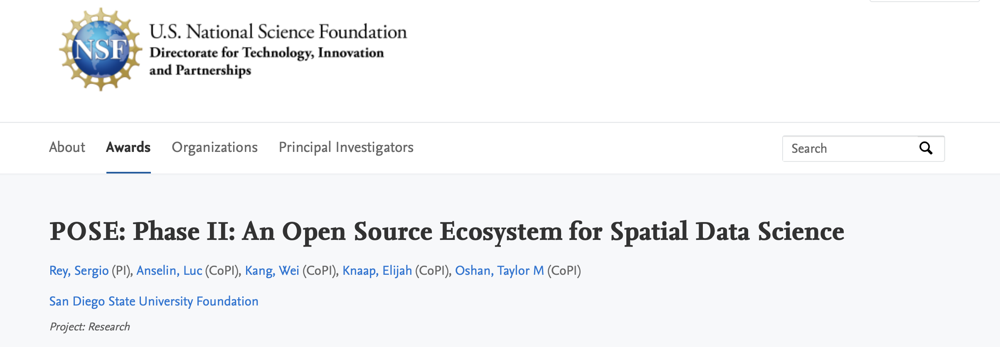
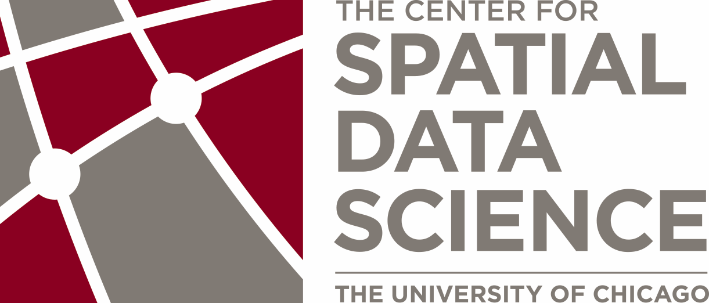

# Spatial Data Science Summit 2026

***Spatial Data Science Summit 15-16 March 2026 - Berkeley, CA***

*The Spatial Data Science Summit, a part of the NSF-funded project “An Open Source Ecosystem for Spatial Data Science (OSESDS)”, will convene researchers, developers, educators, and community leaders to discuss opportunities and challenges in building a more open, interoperable, and sustainable geospatial ecosystem.* 


## Sponsors

### Presenting sponsor

Contributions to the summit are funded by the NSF POSE II award: [An Open Source Ecosystem for Spatial Data Science](https://nsf.elsevierpure.com/en/projects/pos-phase-ii-an-open-source-ecosystem-for-spatial-data-science/).

[](https://nsf.elsevierpure.com/en/projects/pos-phase-ii-an-open-source-ecosystem-for-spatial-data-science/)


### Delivery sponsors


Thank you to Berkeley Institute for Data Science for providing staff and venue in-kind support for the Summit.

[](https://bids.berkeley.edu)

### Travel sponsors

The following organizations supported team members to attend the Summit.

[](https://spatial.uchicago.edu)

[](http://cogs.sdsu.edu)

[](https://spatial.ucr.edu/)


## Location


```{embed} #fig:event-map
:remove-input: true
:remove-output: false


